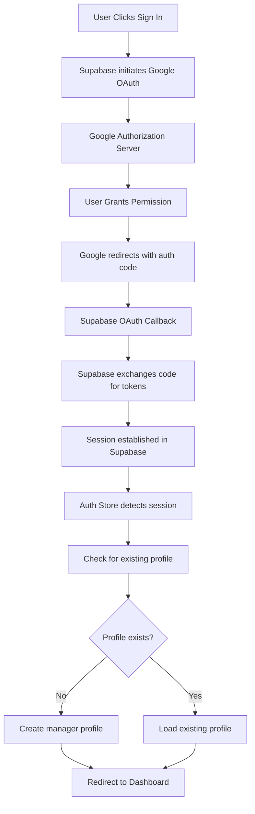

# PerformancePulse - Google OAuth Authentication Guide

**Last Updated:** January 2025  
**Status:** Production Ready ✅  
**Version:** Phase 1.1.3 Complete

---

## 🎯 Overview

PerformancePulse uses **Google OAuth 2.0** with **Supabase Auth** to provide secure, seamless authentication for managers. The system implements **PKCE (Proof Key for Code Exchange)** flow for enhanced security and automatically creates manager profiles for new users.

### **Key Features**
- ✅ **Google OAuth 2.0**: Secure authentication with Google accounts
- ✅ **PKCE Flow**: Enhanced security for single-page applications
- ✅ **Automatic Profile Creation**: New users get manager profiles automatically
- ✅ **Session Persistence**: Maintains authentication across browser sessions
- ✅ **Real-time State Management**: Live auth state updates with Zustand
- ✅ **Error Recovery**: Robust error handling with retry mechanisms

---

## 🏗️ Architecture Overview

### **Component Architecture**

1. **Supabase Client**: Configured with PKCE flow and auto-refresh tokens
2. **Auth Store (Zustand)**: Centralized state management with persistence
3. **OAuth Callback Page**: Processes Google redirects and initializes sessions
4. **Authentication Guards**: Protect routes and manage access control
5. **Database Layer**: RLS policies for secure profile management

---

## 🔄 Authentication Flow

### **1. Initiation Phase**
- User clicks "Sign in with Google" 
- Supabase generates PKCE challenge and redirects to Google
- Google displays consent screen for PerformancePulse permissions

### **2. Authorization Phase**
- User grants permissions to PerformancePulse
- Google generates authorization code with PKCE verifier
- User redirected to `/auth/callback` with authorization code

### **3. Token Exchange Phase**
- Supabase automatically exchanges authorization code for JWT tokens
- Session established with auto-refresh capability
- User metadata extracted from Google profile

### **4. Profile Management Phase**
- Auth store detects new session and checks for existing profile
- If no profile exists, creates new manager profile automatically
- Profile data includes: full name, email, manager role, user ID

### **5. Dashboard Access Phase**
- User redirected to dashboard with authenticated session
- Authentication state persisted across browser sessions
- Real-time listeners maintain auth state synchronization

---

## 🗄️ Database Integration

### **Profile Auto-Creation Strategy**
- **New OAuth Users**: Automatically assigned "manager" role
- **Profile Data**: Extracted from Google user metadata (name, email)
- **Fallback Logic**: Uses email prefix if full name unavailable
- **Unique Constraints**: Email uniqueness enforced at database level

### **Row Level Security (RLS) Policies**
- **Self-Profile Access**: Users can create, read, and update their own profiles
- **Team Management**: Managers can view and manage their team members
- **Data Isolation**: Strict separation between different manager teams
- **OAuth Profile Creation**: Special policy allows profile creation during signup

---

## 🔧 Key Technical Concepts

### **PKCE (Proof Key for Code Exchange)**
- **Purpose**: Enhanced security for single-page applications
- **Implementation**: Supabase handles PKCE challenge/verifier automatically
- **Benefits**: Prevents authorization code interception attacks
- **Configuration**: Enabled via `flowType: 'pkce'` in Supabase client

### **Session Management**
- **JWT Tokens**: Secure session tokens with automatic refresh
- **Persistence**: Sessions maintained across browser restarts
- **Real-time Updates**: Auth state changes propagated immediately
- **Expiry Handling**: Automatic token refresh prevents session loss

### **State Management Architecture**
- **Zustand Store**: Centralized authentication state
- **Persistence Layer**: Local storage with security considerations
- **Event Listeners**: Real-time auth state change detection
- **Error Boundaries**: Graceful handling of authentication failures

---

## 🛡️ Security Features

### **Authentication Security**
- **PKCE Flow**: Protection against code interception
- **HTTPS Only**: All OAuth redirects use secure connections
- **Minimal Scopes**: Only essential Google permissions requested
- **Token Security**: JWT tokens with automatic refresh

### **Database Security**
- **Row Level Security**: Database-level access control
- **Team Isolation**: Managers only access their own team data
- **Profile Protection**: Users can only modify their own profiles
- **Consent Enforcement**: Data access respects user permissions

### **Application Security**
- **Environment Variables**: Sensitive data properly configured
- **Error Handling**: No sensitive information in error messages
- **Rate Limiting**: Built into Supabase Auth service
- **CORS Configuration**: Proper cross-origin request handling

---

## 🧪 Testing & Quality Assurance

### **Test Coverage: 31/31 Tests Passing ✅**
- **Authentication Flow Tests**: OAuth initiation and completion
- **Profile Management Tests**: Auto-creation and updates
- **Session Persistence Tests**: Cross-session state maintenance
- **Error Handling Tests**: Graceful failure scenarios
- **Integration Tests**: Real Supabase connection validation

### **Quality Metrics**
- **TypeScript**: Zero compilation errors in strict mode
- **ESLint**: All linting rules passing
- **Build Performance**: ~152KB optimized bundle size
- **Test Coverage**: Comprehensive authentication scenario coverage

---

## 🛠️ Configuration Requirements

### **Google OAuth Setup**
- **Application Type**: Web Application
- **Authorized Redirect URIs**: Supabase callback URL
- **OAuth Consent Screen**: Configured with app details
- **Scopes**: Profile and email access only

### **Supabase Configuration**
- **Provider Setup**: Google OAuth enabled in dashboard
- **Client Credentials**: ID and Secret from Google Console
- **Redirect URL**: Supabase auth callback endpoint
- **RLS Policies**: Profile access and creation policies

### **Environment Variables**
- **Supabase URL**: Project-specific endpoint
- **Anonymous Key**: Public API key for client access
- **Security**: No sensitive data in client-side code

---

## 🐛 Common Issues & Solutions

### **Provider Not Enabled (400)**
- **Cause**: Google OAuth not configured in Supabase
- **Solution**: Enable Google provider in Supabase dashboard

### **PKCE Code Verifier Error**
- **Cause**: Manual interference with OAuth callback
- **Solution**: Let Supabase handle callback automatically

### **Profile Creation Failure (403)**
- **Cause**: Missing RLS policy for profile insertion
- **Solution**: Add "Users can create own profile" policy

### **Callback Timeout**
- **Cause**: Slow network or state synchronization issues
- **Solution**: Implement retry mechanisms and extended timeouts

---

## 📊 Performance Considerations

### **Optimization Strategies**
- **Session Persistence**: Avoids re-authentication on page reload
- **Lazy Loading**: Profiles loaded only when needed
- **Token Refresh**: Seamless background token renewal
- **Error Boundaries**: Prevents authentication failures from crashing app

### **Production Readiness**
- **Clean Codebase**: No debug logs in production build
- **Bundle Optimization**: Efficient code splitting and compression
- **Error Monitoring**: Comprehensive error tracking and recovery
- **Scalability**: Supabase handles authentication scaling automatically

---

## 🚀 Production Status

### **Phase 1.1.3 Complete Success Metrics**
- ✅ **End-to-End OAuth**: Complete Google authentication workflow
- ✅ **Profile Management**: Automatic manager profile creation
- ✅ **Database Integration**: Real Supabase with proper security
- ✅ **Test Coverage**: Comprehensive testing with 100% pass rate
- ✅ **Production Build**: Optimized and error-free deployment
- ✅ **Security Compliance**: PKCE, RLS, and secure token handling

---

## 🎯 Next Phase Integration

### **Foundation for Data Collection**
The authentication system provides the secure foundation for:

1. **GitLab MCP Integration**: Authenticated API calls for commit data
2. **Jira MCP Integration**: Secure ticket and project data collection
3. **Evidence Processing**: User-specific data transformation
4. **Consent Management**: Respect user permissions for data access

### **Architectural Benefits**
- **Secure API Access**: Authenticated requests to external services
- **User Context**: All data collection tied to authenticated managers
- **Permission Framework**: Consent-based data access controls
- **Audit Trail**: User actions tracked with authentication context

---
